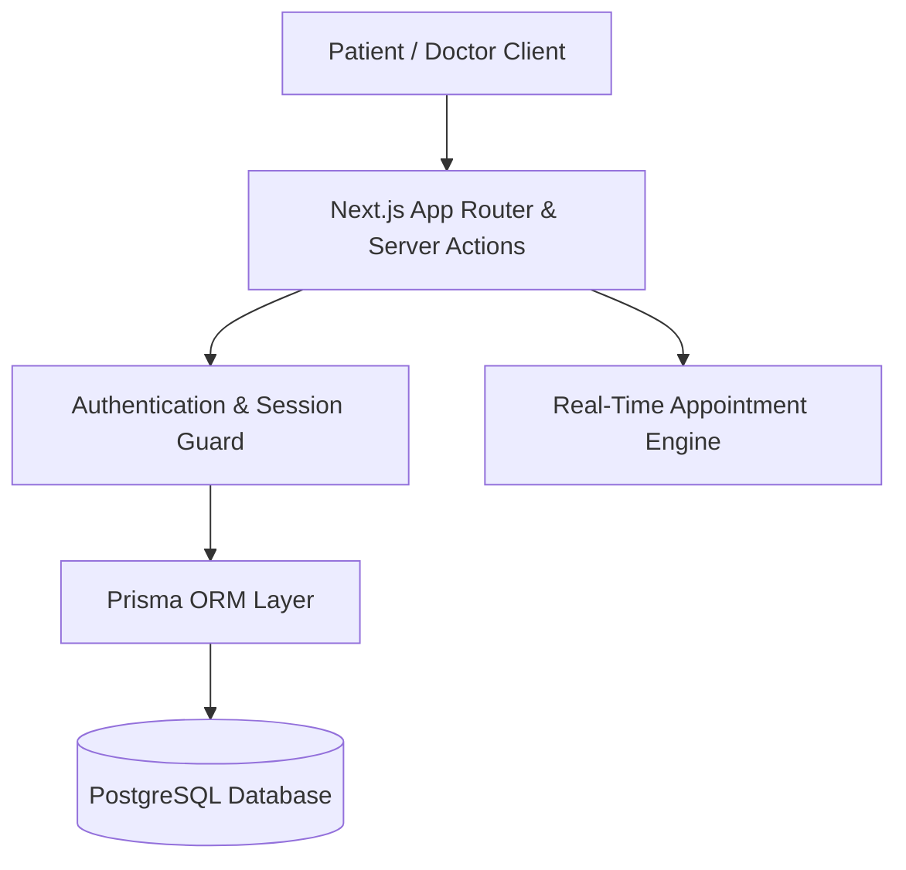

<div align="center">

# 🏥 MedConnect — Telemedicine Platform

<p align="center">
  <strong>Next-Generation Digital Health & Doctor-Patient Consultation System</strong>
</p>

<p align="center">
      
</p>

<p align="center">
  <a href="#-overview">Overview</a> •
  <a href="#-system-architecture">Architecture</a> •
  <a href="#-key-features--capabilities">Key Features</a> •
  <a href="#-tech-stack--tools">Tech Stack</a> •
  <a href="#-quick-start">Quick Start</a> •
  <a href="#-author--license">Author</a>
</p>

</div>

---

## 📌 Overview

MedConnect is an end-to-end digital health platform connecting patients with certified medical professionals through real-time appointment scheduling, virtual consultations, and encrypted electronic health records (EHR).

---

## 🏗️ System Architecture


```mermaid
graph TD
    A[Patient / Doctor Client] --> B[Next.js App Router & Server Actions]
    B --> C[Authentication & Session Guard]
    C --> D[Prisma ORM Layer]
    D --> E[(PostgreSQL Database)]
    B --> F[Real-Time Appointment Engine]
```

---

## ✨ Key Features & Capabilities

- 👨‍⚕️ **Doctor Search & Specialty Filters**: Search by medical specialty, consultation fees, and patient reviews.
- 📅 **Dynamic Calendar Scheduling**: Interactive calendar booking with conflict prevention algorithms.
- 📋 **Electronic Health Records (EHR)**: Secure storage of patient clinical history, lab reports, and prescriptions.
- 🔒 **Enterprise Security**: Role-based access control and patient data privacy protection.

---

## 🛠️ Tech Stack & Tools

- **TypeScript**
- **Next.js**
- **React**
- **PostgreSQL**
- **Prisma ORM**
- **Tailwind CSS**

---

## 🚀 Quick Start

### 📋 Prerequisites
Ensure you have the required runtime environment installed:
* **Git** version 2.30+
* **Python 3.9+** / **Node.js 18+** / **Android Studio** (depending on project stack)

### 📥 Installation & Setup

```bash
# 1. Clone the repository
git clone https://github.com/muhammadokashapak/medconnect.git

# 2. Enter the directory
cd medconnect
```

---

## 👨‍💻 Author & License

<div align="center">

**Muhammad Okasha**
<br/>
*Deep Learning & Mobile Software Engineer*
<br/><br/>
<a href="https://github.com/muhammadokashapak"></a>
<a href="https://linkedin.com/in/muhammad-okasha"></a>
<a href="mailto:muhammadokashapak@gmail.com"></a>

<br/><br/>

*⭐️ If you find this project helpful, please consider giving it a star! • © 2026 [Muhammad Okasha](https://github.com/muhammadokashapak)*

</div>
